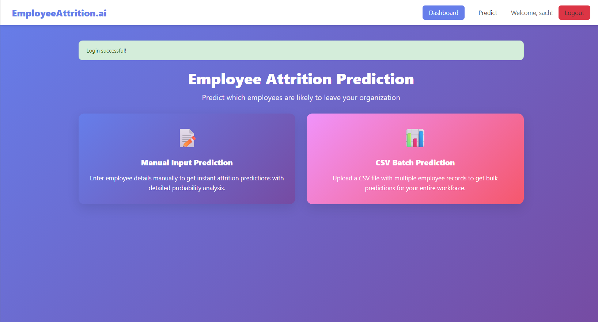
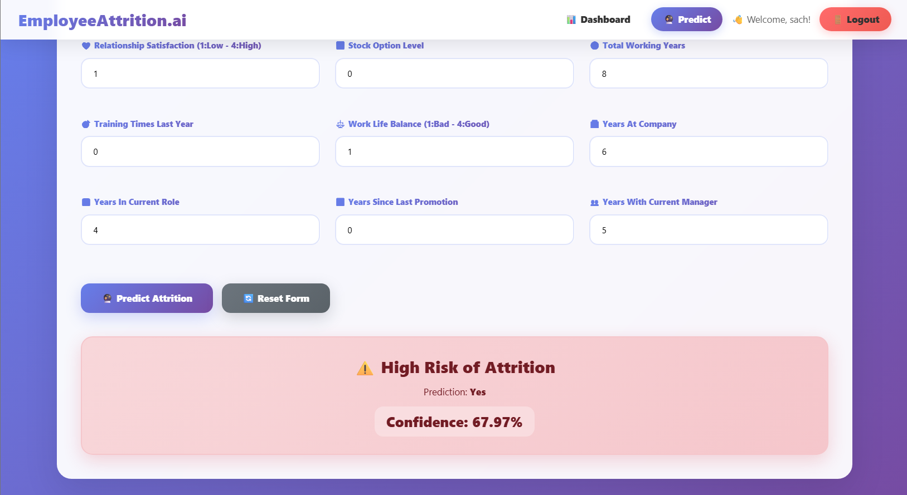
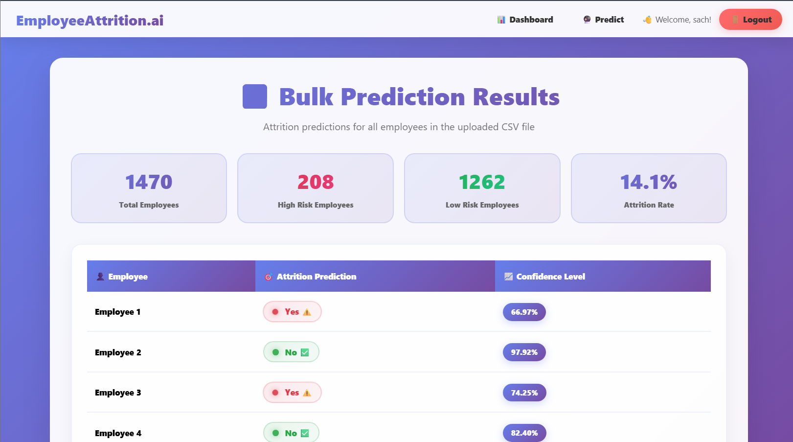

# Employee Attrition Prediction System

## Project Overview
This project is a Machine Learning based Employee Attrition Prediction System developed using Python, Flask, and Scikit-learn.

The system predicts whether an employee is likely to leave the organization based on employee-related factors such as job satisfaction, work-life balance, income, experience, and performance.

The application also includes:
- User Login & Signup System
- Manual Prediction
- CSV Batch Prediction
- Dashboard Interface
- Confidence Score Prediction

---

## Features

- Employee Attrition Prediction
- Flask Web Application
- Login & Signup Authentication
- Bulk CSV Prediction
- Probability/Confidence Score
- Interactive Dashboard
- Machine Learning Model Integration

---

## Technologies Used

- Python
- Flask
- Scikit-learn
- Pandas
- NumPy
- HTML
- CSS
- JavaScript

---

## Project Structure

```bash
Employee Attrition/
│
├── static/
├── templates/
├── app.py
├── model.py
├── train_model.py
├── Dataset.csv
├── requirements.txt
└── README.md

## Project Screenshots

### Login Page


### Dashboard


### Manual Prediction


### Bulk Prediction Results

